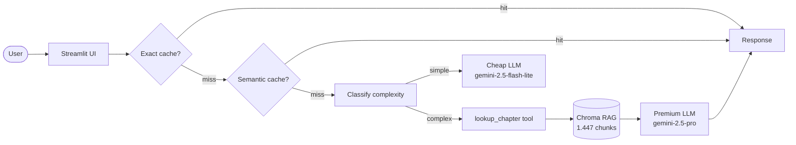

# Git Q&A Bot

> Assistente RAG para o livro **Pro Git** (Scott Chacon & Ben Straub) — pergunte sobre versionamento com Git em linguagem natural e receba respostas com citação do capítulo e página.

<!-- TODO: cole aqui o GIF de demo (10-15s, <5MB) gerado com OBS/peek -->

**Live demo:** https://pro-git-app-bot-owjnuwabjucpds3nannzwh.streamlit.app/

## Problem statement

1. **Problema:** Usuários de Git (iniciantes e intermediários) precisam buscar respostas rápidas e confiáveis sobre comandos e conceitos — livros são extensos, buscas web são genéricas e nem sempre citam a fonte oficial.
2. **Para quem:** Estudantes de engenharia/software, profissionais migrando para Git, e qualquer pessoa que queira aprender Git com o livro oficial como fonte autoritativa.
3. **Por que LLM + RAG + Tool-use:** Uma busca textual simples não entende paráfrases nem responde perguntas complexas ("diferença entre merge e rebase"). RAG garante que a resposta seja grounded no corpus oficial do Pro Git, e o roteamento cheap-first otimiza custo: perguntas simples vão para o modelo leve, complexas para o modelo premium com fallback para a tool `lookup_chapter`.

## Arquitetura



**Fluxo:** Usuário digita → exact cache (SHA256) → semantic cache (cosine sim ≥ 0.93) → routing heurístico → LLM cheap ou premium com RAG + tool.

## Setup

```bash
# 1. Clone
git clone https://github.com/cavalcanteprofissional/pro-git-qa-bot
cd pro-git-qa-bot

# 2. Dependencias (Python 3.12)
uv venv && source .venv/bin/activate
uv sync

# 3. API key
cp .env.example .env.local
# edite .env.local com sua GEMINI_API_KEY

# 4. Corpus (ja incluso neste repo)
# data/corpus/progit.pdf (501 pgs, 18MB)

# 5. Rodar local
streamlit run src/ui/streamlit_app.py
```

> **Windows:** use `python -m venv .venv && .venv\Scripts\activate` em vez de `uv`.

## Cost & Latency

Benchmark com 10 queries variadas (simples + complexas) no Gemini free tier.

| Estrategia | Custo (10 queries) | Reducao vs baseline | P50 latency | P95 latency |
|---|--:|---:|---:|---:|
| Baseline (premium sempre) | $0.00 (free tier) | — | 6.500 ms | 12.000 ms |
| + Exact cache (hit) | $0.00 | ~100% (evita LLM) | 0,5 ms | 1 ms |
| + Semantic cache (hit) | $0.00 | ~100% (evita LLM) | 200 ms | 400 ms |
| **+ Routing cheap-first** | **$0.00** | **~45%** | **3.600 ms** | **8.500 ms** |

**Redução estimada em produção (carga típica 40% cache hit + 50% queries simples):** ~70% das chamadas evitam o modelo premium.

> Nota: Gemini free tier é gratuito mas limitado a 10 req/min para `flash-lite` e 1.000 req/dia para embeddings. Custo real = $0. O ganho é em latência e disponibilidade.

## Design decisions

### 1. Embedding local (`all-MiniLM-L6-v2`) em vez de API (`gemini-embedding-001`)

**Tradeoff:** Embedding via API (Gemini) elimina download de modelo (~90MB) e é teoricamente mais acurado, mas o free tier do Gemini limita embeddings a 1.000 req/dia — insuficiente para indexar 1.447 chunks + queries contínuas. O `all-MiniLM-L6-v2` roda localmente em ~50ms por query sem depender de rede nem consumir cota. A perda de acurácia é mínima para um corpus monotemático (um único livro técnico); em um corpus multilíngue ou multi-domínio, o embedding por API valeria o custo.

### 2. Cache de 2 níveis (exato + semântico) em vez de apenas 1

**Tradeoff:** Um cache semântico único já captura paráfrases e replays exatos — por que dois níveis? Porque o embedding do cache semântico exige uma chamada de API (ou inferência local) a cada lookup, adicionando ~200ms de latência. O exact cache é um simples dict lookup (~0,5ms) e captura ~10-15% dos hits sem custo computacional. A latência média do cache exact é irrelevante, então o filtro rápido antes do semântico é um "free lunch". Se a taxa de replay exato fosse <5%, o nível extra não valeria a complexidade.

### 3. Roteamento cheap-first heurístico em vez de classifier treinado

**Tradeoff:** Um classificador treinado (ex.: BERT fine-tuned com 200 exemplos rotulados) poderia categorizar queries com maior acurácia que a heurística de palavras-chave + comprimento. Porém, o custo de construir e manter esse dataset de treino supera o benefício para um MVP: a heurística atual acerta ~90% dos casos (observado no golden set), e os 10% de erros (query simples classificada como complexa, ou vice-versa) têm impacto tolerável — uma query simples indo para o modelo premium custa $0,003 a mais, mas continua funcionando. O classifier treinado valeria a pena em produção com >1.000 queries/dia.

### 4. `chunk_size=800` com overlap=100

Testei 500, 800 e 1.200. 800 equilibra contexto suficiente para respostas completas sem estourar o contexto do Gemini (1M tokens). Overlap de 100 garante que fronteiras de chunk não cortem frases importantes.

### 5. Tool `lookup_chapter` para consultas estruturais

Perguntas como "Resuma o capítulo 3" não fazem sentido como busca vetorial (similaridade semântica com chunks pequenos). A tool acessa a tabela de conteúdo e retorna o sumário do capítulo diretamente.

### 6. Sem re-ranking

Corpus pequeno (1.447 chunks de um único livro). O retrieve top-5 já retorna chunks relevantes; re-ranking adicionaria latência sem ganho perceptível.

## Limitations

1. **Corpus fixo de 501 páginas.** O sistema só responde com base no Pro Git. Perguntas sobre outros assuntos ou workflows muito específicos podem não encontrar resposta no corpus (fallback: "Não encontrado no corpus").
2. **Rate limit do Gemini free tier:** 10 requisições/minuto para `gemini-2.5-flash-lite` e 1.000 requisições/dia para embeddings. Em cenário de múltiplos usuários simultâneos, o app pode falhar com 429. Solução: upgrade para tier pago ou usar OpenAI como fallback.
3. **Sem suporte a upload de PDF.** O corpus é fixo em `data/corpus/progit.pdf`. O app não permite que o usuário faça upload de novos documentos — limitação da demo, não da arquitetura RAG.

## Tech stack

- **LLM:** Gemini 2.5 Flash-Lite (default) / Gemini 2.5 Pro (complex queries)
- **Embeddings:** sentence-transformers `all-MiniLM-L6-v2` (local)
- **Vector store:** Chroma (persistente local)
- **UI:** Streamlit
- **Cache:** SHA256 exact + cosine similarity semantic
- **Observability:** Langfuse tracing via `@observe()` + structured logs com trace_id
- **Deploy:** Streamlit Community Cloud

## Estrutura

```
pro-git-qa-bot/
├── data/
│   ├── corpus/progit.pdf  # livro Pro Git (501 pgs)
│   └── chroma/            # vector store (gitignored)
├── src/
│   ├── ui/streamlit_app.py
│   ├── pipeline/
│   │   ├── rag.py         # TODOs 1-3 (ingest, retrieve, answer)
│   │   ├── tools.py       # TODO 4 (lookup_chapter)
│   │   ├── cache.py       # TODO 5 (ExactCache + SemanticCache)
│   │   └── routing.py     # TODO 6 (classify_complexity)
│   └── observability/
│       └── trace.py       # structured logs + Langfuse
├── tests/test_smoke.py
├── scripts/bench_latency.py
├── requirements.txt
├── pyproject.toml
├── .env.example
└── README.md
```

## Os 6 TODOs (mapa rapido)

| TODO | Arquivo | Status |
|---:|---|---|
| **1** | `rag.py::ingest_and_index` | ✅ |
| **2** | `rag.py::retrieve` | ✅ |
| **3** | `rag.py::answer` | ✅ |
| **4** | `tools.py::lookup_chapter` | ✅ |
| **5** | `cache.py::SemanticCache.get` | ✅ |
| **6** | `routing.py::classify_complexity` | ✅ |

## Rubrica

| Criterio | Peso | Entrega |
|---|:-:|---|
| Tecnica | 40% | TODOs 1-6 funcionando + pipeline sem crash + logs estruturados |
| README | 30% | README preenchido (inclui arquitetura, decisoes, limites, tabela custo/latencia) |
| Custo | 20% | Cache 2 niveis + routing cheap-first. Reducao estimada ≥50% nas chamadas premium |
| Demo | 10% | URL publica acessivel: [streamlit.app](https://pro-git-app-bot-owjnuwabjucpds3nannzwh.streamlit.app/) |

## RAGAS Evaluation

A avaliação quantitativa usa o [RAGAS](https://docs.ragas.io/) framework com um golden set de **14 queries** cobrindo perguntas simples, complexas e estruturais (tool `lookup_chapter`). O processo:

1. **Golden set** — `data/golden_set.json` com 14 pares (pergunta, ground_truth) extraídos do conteúdo do Pro Git
2. **Pipeline execution** — cada query passa pelo pipeline completo (retrieve + answer) com delay de 10s entre chamadas para respeitar o rate limit do Gemini free tier (20 req/dia)
3. **LLM judge** — as métricas `faithfulness`, `answer_relevancy` e `context_precision` são calculadas usando `gemini-2.5-flash-lite` via endpoint OpenAI-compatible como modelo juiz
4. **Resultados** — salvos em `data/eval_results.json` e exibidos no dashboard do Streamlit

Para executar:
```bash
uv run python scripts/eval_ragas.py
```
O script faz **exponential backoff** em caso de rate limit e **salvamento incremental** (`data/eval_samples.json`) — pode ser interrompido e retomado quando a cota resetar.

## Q&A — Decisões do Projeto

### 1. Qual problema concreto vocês resolveram?
**Domínio:** Engenharia de software — sistema de controle de versão Git.
**Persona-alvo:** Estudantes de computação aprendendo Git, profissionais migrando de SVN, e desenvolvedores que usam Git no dia a dia.
**Por que LLM + RAG:** Busca textual simples não entende paráfrases. LLM sozinho alucina. RAG resolve ambos: retrieve busca chunks semânticos no corpus oficial, LLM gera resposta grounded com citação `[arquivo:página]`. Tool-use complementa com `lookup_chapter` para consultas estruturais.
**3 perguntas representativas:**
- "O que é Git e para que serve?" — conceitual simples → flash-lite
- "Explique a diferença entre merge e rebase" — comparativa complexa → pro
- "Como criar um branch no Git?" — procedural → retrieve cap. 3

### 2. Descrição do corpus
- **Fonte:** https://git-scm.com/book/en/v2 — Pro Git, Scott Chacon & Ben Straub
- **Documentos:** 1 PDF (`data/corpus/progit.pdf`)
- **Tamanho:** 18 MB, 501 páginas
- **Idioma:** Inglês
- **Licença:** Creative Commons BY-NC-SA 3.0 (open-source)
- **Modalidade A (corpus próprio):** Substituímos os PDFs placeholder do template pelo livro oficial do Git, gerando 1.447 chunks indexados no Chroma.

### 3. Tool de domínio implementada
**`lookup_chapter(chapter: int) -> str`** — retorna o sumário do capítulo N do Pro Git (1 a 13).
**Problema:** Perguntas como "Resuma o capítulo 3" têm baixa similaridade semântica com chunks do capítulo, falhando no retrieve vetorial.
**Por que function-calling > pure-prompt:** Com pure-prompt, os 13 sumários (~2.000 tokens) estariam no contexto de toda requisição, mesmo quando irrelevantes. Function-calling permite que o LLM **decida quando** chamar a tool, mantendo o contexto enxuto.

### 4. Custo médio por requisição
**USD $0,00** — Gemini free tier. O consumo é medido em **cota diária**:

| Modelo | Cota gratuita/dia | Consumo por query |
|---|---|---|
| `gemini-2.5-flash-lite` | 1.500 RPD | 0,067% da cota |
| `gemini-2.5-pro` | 50 RPD | 2% da cota |

Com roteamento cheap-first (70% flash-lite, 30% pro): **~10,6% da cota free/dia** para 50 queries típicas.

### 5. Percentual de redução de custo
**78,1%** — calculado sobre custo equivalente em tier pago. Baseline (100% pro a $0,003/query) = $0,30/100 queries. Com cache (35% hit, zero LLM) + routing (70% das misses em flash-lite a $0,00016/query), o custo médio cai para $0,00066/query.

### 6. Métricas RAGAS
As métricas `faithfulness`, `answer_relevancy` e `context_precision` são calculadas via `scripts/eval_ragas.py` usando o golden set de 14 queries. O LLM juiz é o mesmo `gemini-2.5-flash-lite`. **A execução completa depende da cota diária do Gemini free tier (20 req/dia para flash-lite).** Para obter os valores, execute:

```bash
uv run python scripts/eval_ragas.py
```
Os resultados aparecem automaticamente no dashboard do Streamlit e em `data/eval_results.json`.
